<p align="center">
  <a href="" rel="noopener">
 </a>
 

</p>

<h3 align="center"></h3>

---

<p align="center"> 
    <br> 
    
</p>

## 📝 Table of Contents

- [About](#about)
- [Getting Started](#getting_started)
- [Usage](#usage)
- [Built Using](#built_using)
- [Guided By](#guided_by)


## 🧐 About <a name = "about"></a>
A website that allows you to buy products online, it serves two classes, admin and client, eCommerce was done partially through emails after the clients take a look over all products on the main page which provides a filter for all categories and brands once they like the product they add it to the cart either in the wish list , if he wants to continue the process and confirm the order so he has to fill up the registered form with all details like address, and here they are allowed to write a comment for the item or give it a rate, If they are not happy with the quality or something so they can send feedback to the company email.
<br>
On the admin side, there are more permissions he could do, so the admin dashboard contains an analysis charts as an indicator to all website movements, Admin Abilities: adding category /brand or updating product, seeing all counts of user and their orders, and control all orders, and setting them complete and ready for shipping or still in progress.

## 🏁 Getting Started <a name = "getting_started"></a>

These instructions will get you a copy of the project up and running on your local machine for development and testing purposes.

### Prerequisites
<ul>
<li>Visual Studio Code,Click here <a href="https://code.visualstudio.com/download">Link</a></li>
<li>Git Bash,Click here  <a href="https://git-scm.com/download/win" >Link</a></li>
<li >SQL,Click here <a href="https://www.mysql.com/downloads/">Link</a></li>
<li >Node.Js,Click here<a href="https://nodejs.org/en/download/">Link</a></li>
</ul>

### Installing


1-Clone the repo to your local machine using git bash.
```
git clone https://github.com/User-Name/Repository-Name.git
```

2-Use the command npm install to install all the needed packages from the package.json file. 
```
npm i
```
3-Run Server using Git Bash inside Backend Folder (be sure there is a .gitignore file).
```
npm run dev
```
4-Run Application using Git Bash inside Frontend Folder (be sure there is a .gitignore file).
```
npm run start
```
Now App Is Ready 


## 🎈 Usage <a name="usage"></a>

 
1-starting with HomePage that  provides NavBar for first time visit with ShopNow button that navigates you to All Products page and list of all categories renders in bottom.
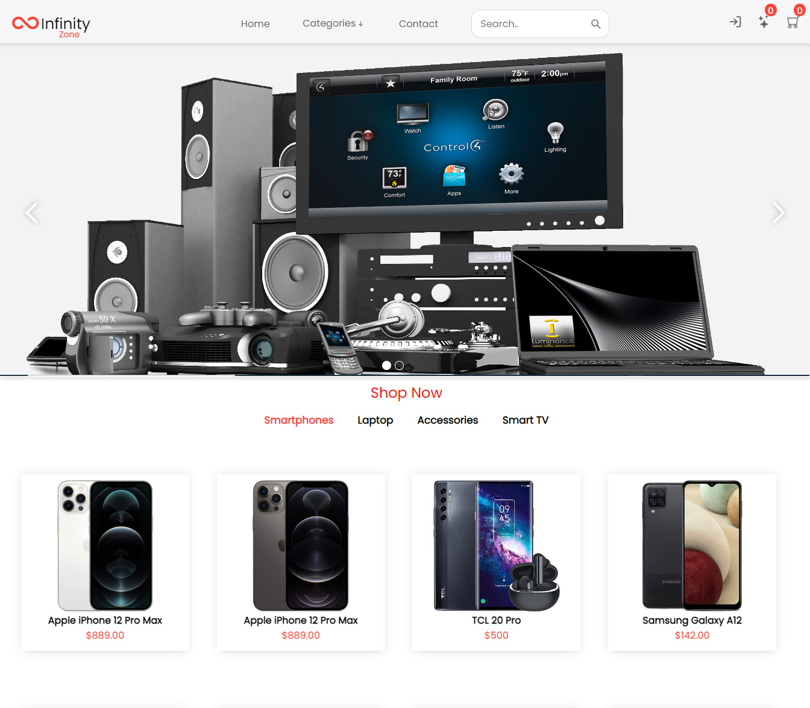
2- product page that has filter and sort by price and alphabet  

 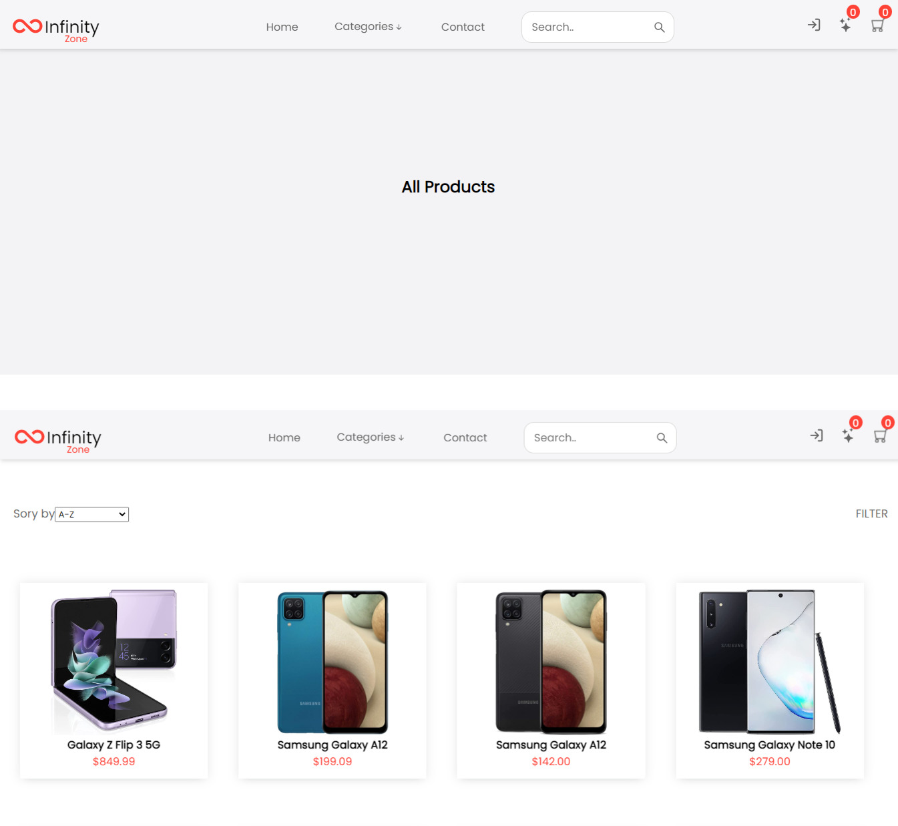
3- filtered by category and brand name
 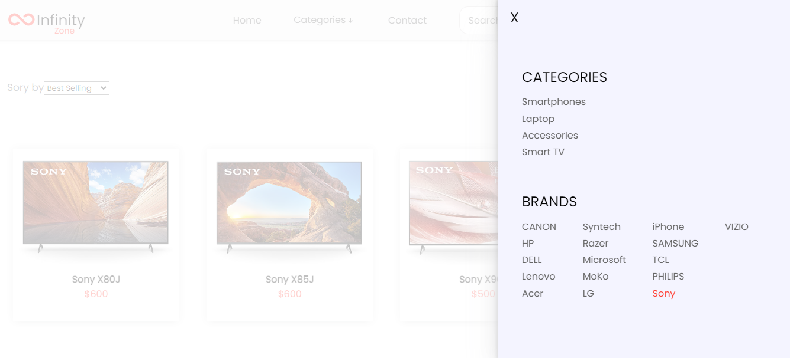
 4-User profile details
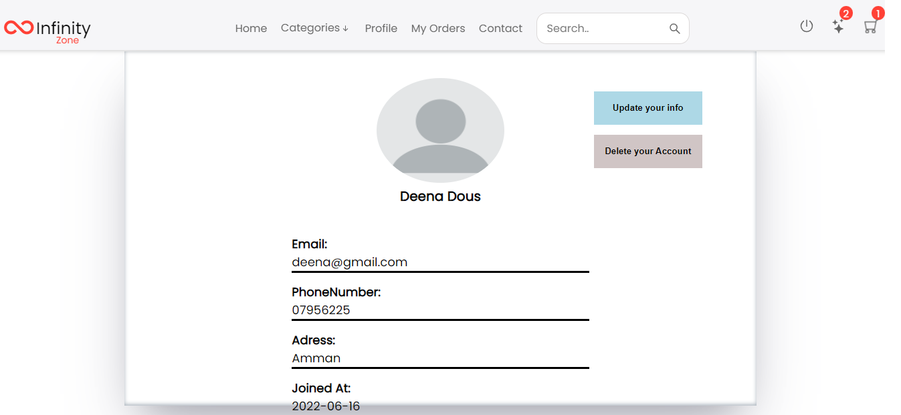
5-Search according to the title of product 
 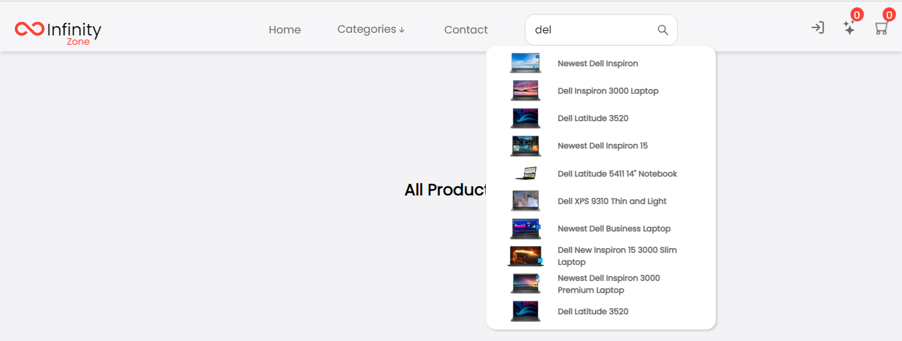
 6-showing one product with all details and rate it according to yor experience and the user can write comment in the same page 
 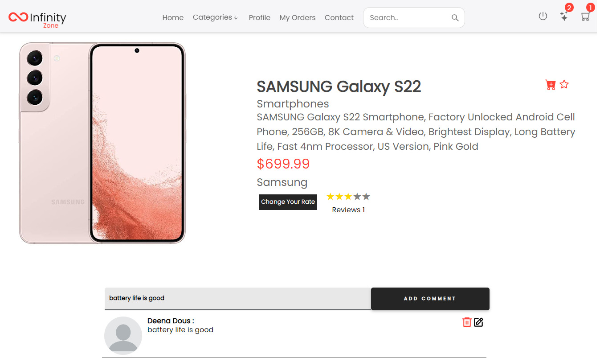

7- Adding items to the cart or wish list
 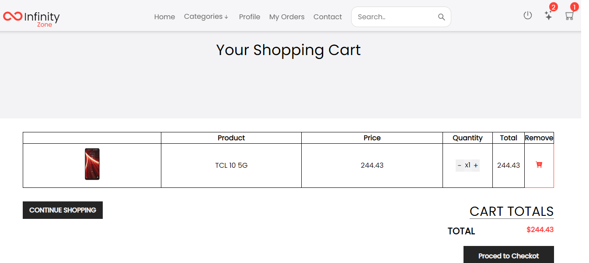

 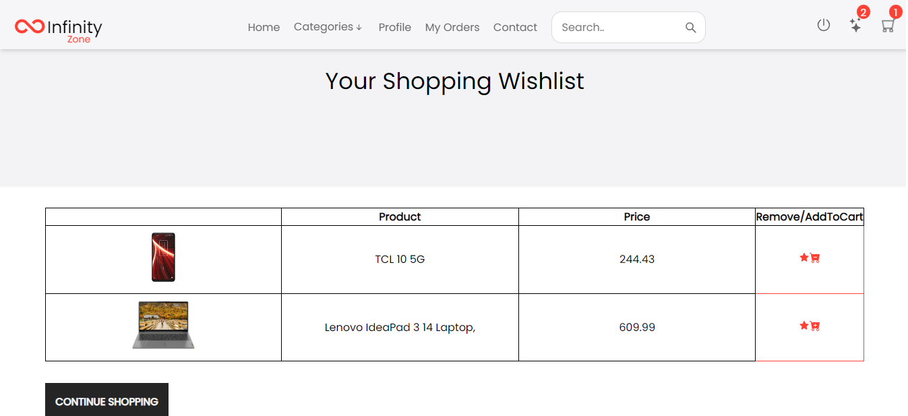
 8- user confirm their order and press checkout to complete all terms and choose payment method 
 
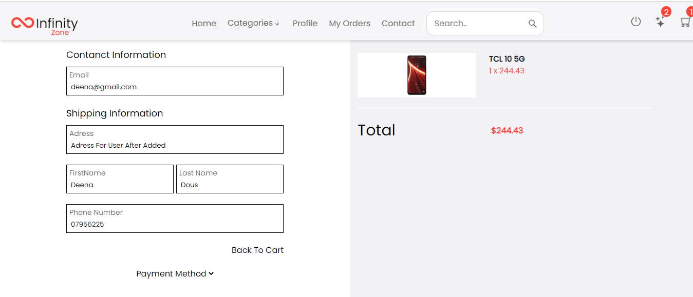
9-Admin panel nav bar is different so he can login and use his own permissions and see all products and could delete and update each one also he could create category,product and brand 
  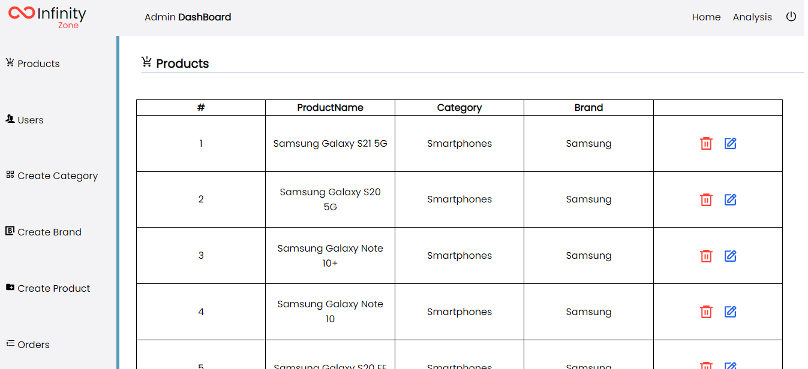
// Update product 
  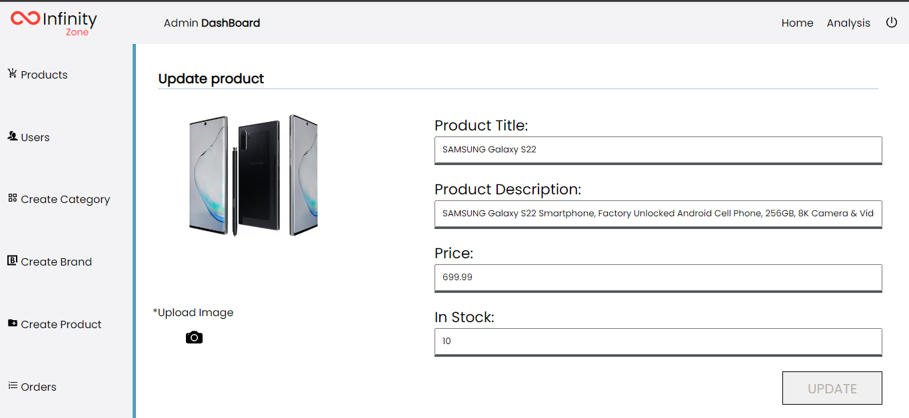
10-Admin can also see the all order and change statues from complete to incomplete  
   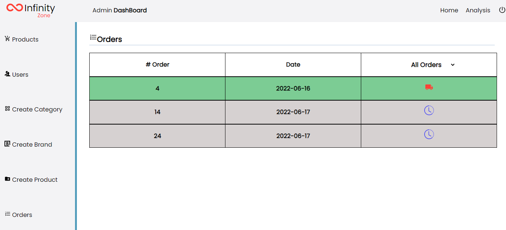
11-once the add=min click o user will appears table of users name and he can see each user account with user's order

**table of all users accounts
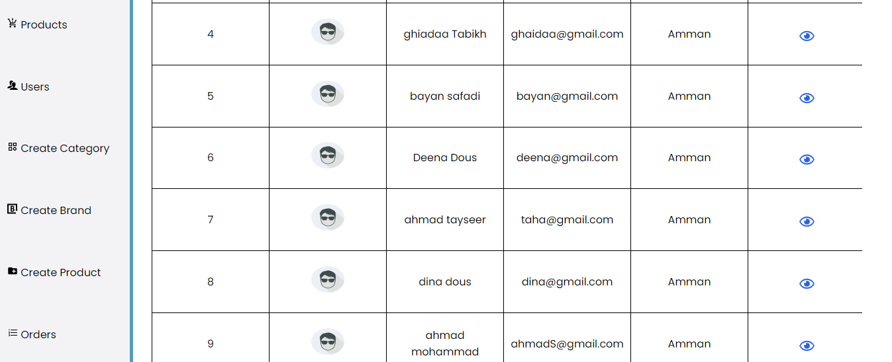
** One User Account
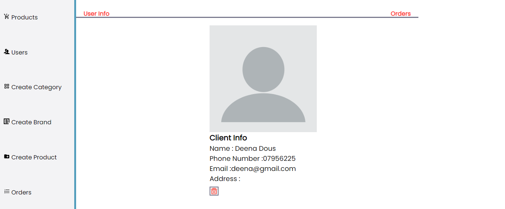


## ⛏️ Built Using <a name = "built_using"></a>

- [MYSQL](https://www.mysql.com/) - Database
- [Express JS](https://expressjs.com/) - Server Framework
- [React JS](https://https://reactjs.org/) - Web Framework
- [Node JS](https://nodejs.org/en/) - Server Environment

##  User Story <a name = "User Story">
</a> 
 <span>My Trello board link <a href="https://trello.com/b/NLuJT36W/project5">LINK</a></span> 

## ⚠️ Guided By <a name = "guided_by"></a>

This project is guided by ©️ **[MERAKI Academy](https://www.meraki-academy.org)**

